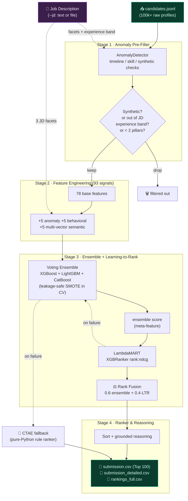
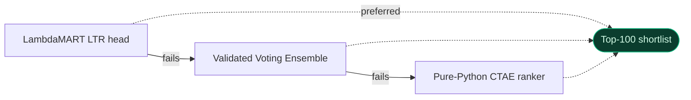
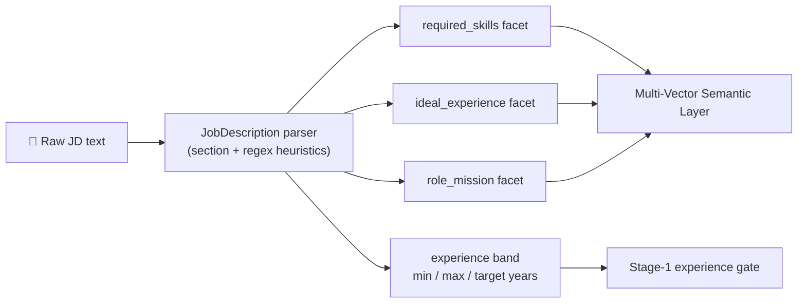

<div align="center">

# 🧭 Staged Hybrid Ranking Engine (SHRE)
### An intelligent, explainable AI recruiter

**Rank the Top 100 Senior AI Engineers from a pool of 100k+ candidates — fast, accurate, and fully explainable.**

<p>
  
  
  
  
  
</p>
<p>
  
  
  
  
  
</p>

</div>

---

This repository implements a **Hybrid Architecture** (Anomaly Pre-Filter → Enriched Feature Engineering → ML Ensemble → Learning-to-Rank) with a pure-Python **CTAE Fallback wrapper** for absolute reliability. It extends the RETRO base with **four targeted enhancements** for deeper JD understanding, richer signal integration, and more accurate, explainable shortlists — all **fully open-source and zero extra cost**.

> **Built for:** *Data & AI Challenge — Intelligent Candidate Discovery (Redrob AI · India Runs).*
> A system that doesn't just filter, but **intelligently ranks**: deep job understanding, contextual relevance beyond keywords, full signal integration, and a lightning-fast, expertly-ranked shortlist with grounded reasoning.

## 📌 At a glance

| | |
|---|---|
| 🎯 **Task** | Rank & shortlist the Top 100 Senior AI Engineers from 100k+ profiles |
| 🧩 **Architecture** | 4-stage hybrid: anomaly filter → 93 features → ensemble → LambdaMART, with CTAE fallback |
| 🧠 **Semantic engine** | Multi-vector `all-MiniLM-L6-v2` embeddings + FAISS (TF-IDF graceful fallback) |
| 📊 **Held-out accuracy** | **90.7%** validation / **88.0%** test (93-feature LTR run) |
| 🏅 **Ranking quality** | NDCG@10 **0.991**, NDCG@100 **0.997**; honest hard-slice Spearman **0.894** |
| ⚡ **Inference** | Loads saved models — **no retraining** — for fast scoring at pool scale |
| 🔌 **Deep JD understanding** | Paste any JD (`--jd`); it re-targets the experience gate + semantic fit |
| 🛟 **Reliability** | Automatic fallback chain: **LTR → validated ensemble → pure-Python CTAE** |

## 🗂️ Table of Contents
- [The Challenge → How SHRE answers it](#-the-challenge--how-shre-answers-it)
- [The Four Enhancements](#-the-four-enhancements)
- [Architecture Overview](#-architecture-overview)
- [Pipeline Flow (diagram)](#-pipeline-flow)
- [Deep Job Understanding](#-deep-job-understanding-custom-jd)
- [Fast Inference vs. Retraining](#-fast-inference-vs-retraining)
- [Installation](#-installation)
- [How to Run](#-how-to-run)
- [Performance Summary](#-performance-summary)
- [Scientific Validation Gallery](#-scientific-validation-gallery)
- [Repository Structure](#-repository-structure)
- [Tech Stack](#-tech-stack)
- [Limitations & Future Work](#-limitations--future-work)
- [Team](#-team)

---

## 🎯 The Challenge → How SHRE answers it

| Challenge requirement | How SHRE delivers it |
|---|---|
| **Deep Job Understanding** — interpret complex, nuanced JDs | `JobDescription` parser turns any raw JD into 3 semantic facets + an experience band (`--jd`), re-targeting both the Stage-1 gate and the semantic-fit signal |
| **Contextual Relevance** — see beyond keywords | Multi-vector transformer embeddings (skills / trajectory / full profile) matched against JD facets via FAISS + weighted fusion |
| **Signal Integration** — profile + career + behavioral signals | 93 dense features: 78 base + 5 anomaly + 5 behavioral (recruiter demand, OSS, reliability) + 5 semantic |
| **The Output** — fast, accurate, expertly-ranked shortlist | LambdaMART LTR fused with the ensemble; fast inference mode; top-100 with grounded, non-hallucinated reasoning |

---

## ✨ The Four Enhancements

| # | Enhancement | What it does | Graceful degradation |
|:-:|---|---|---|
| 1 | **Multi-Vector Semantic Layer** | Separately embeds candidate *skills*, *experience trajectory*, and *full profile* with `all-MiniLM-L6-v2` + **FAISS** retrieval, matches each against three **JD facets**, and fuses them with weighted similarity. | Falls back to a scikit-learn **TF-IDF** encoder if transformers/FAISS are unavailable. |
| 2 | **LambdaMART / XGBoost-LTR head** | An `XGBRanker` (`rank:ndcg`) stacked on the ensemble's class-probability meta-feature and **fused** with the ensemble ordering to optimize the full ranked list. | Falls back to the validated ensemble ordering. |
| 3 | **Enhanced Honeypot / Anomaly Detection** | A multi-signal pre-filter catching timeline overlaps, impossible skill durations, and synthetic-profile flags; its anomaly score also feeds the model. | Continuous score is always produced; never blocks the pipeline. |
| 4 | **Behavioral Scoring Module** | Distills under-utilized Redrob activity / recruiter-demand / OSS / reliability signals into interpretable sub-scores. | Neutral defaults for missing signals. |

<sub>1. **Multi-Vector Semantic Layer** — embeds candidate skills, experience trajectory, and full profile, matches against three JD facets, weighted fusion. 2. **LambdaMART/XGBoost-LTR** — `rank:ndcg` head fused with the ensemble. 3. **Enhanced Honeypot/Anomaly Detection** — multi-signal pre-filter + model feature. 4. **Behavioral Scoring** — activity/demand/OSS/reliability sub-scores.</sub>

### RETRO base → "Opus 4.8" (this repo)

| Capability | RETRO base | Opus 4.8 (this repo) |
|---|---|---|
| Features | 78 base | **93** (+anomaly +behavioral +semantic) |
| Relevance signal | Ensemble class-prob vote | Ensemble **+ LambdaMART LTR fusion** |
| Job understanding | Hardcoded role | **Parsed from any JD** (`--jd`) |
| Semantic matching | — | **Multi-vector transformer + FAISS** |
| Behavioral signals | Partial (a few) | **Full** demand/OSS/reliability sub-scores |
| Anomaly handling | 1.05×/1.5× heuristics | **Multi-signal scored detector** |
| Scoring at scale | Retrain each run | **Fast inference** (load saved models) |
| Macro-F1 (5-fold) | 0.731 | **0.794** |

### Two engines, one guarantee

| | **SHRE** (primary) | **CTAE** (fallback) |
|---|---|---|
| Type | ML ensemble + LTR + semantics | Pure-Python rule engine |
| Dependencies | xgboost, lightgbm, catboost, transformers… | **None** (standard library only) |
| When it runs | Default | If any SHRE stage / import fails |
| Output | Identical CSV schema | Identical CSV schema |
| Purpose | Maximum ranking quality | **Never fail to produce a shortlist** |

---

## 🏗️ Architecture Overview

The system processes candidate data through four stages:

1. **Stage 1 (Anomaly Pre-Filter):** `AnomalyDetector` drops synthetic/honeypot profiles (timeline, skill, and synthetic anomalies), then gates on a **JD-driven experience band** (parsed from the supplied job description, or the default 5–9 target) and a minimum of 2 skill pillars.
2. **Stage 2 (Enriched Feature Engineering):** Computes **93 dense signals** = **78 base** (career progression, domain specialization in RAG/LLMs/Vector DBs, company classification, platform interactions) **+ 5 anomaly + 5 behavioral + 5 multi-vector semantic** features.
3. **Stage 3 (Ensemble + Learning-to-Rank):** A **Voting Ensemble (XGBoost + LightGBM + CatBoost)** — trained with **leakage-safe SMOTE inside CV** — produces a class-probability score that, with the enriched features, feeds a **LambdaMART (XGBoost `rank:ndcg`)** head; the two are fused into the final ranking score.
4. **Stage 4 (Ranker & Reasoning):** Sorts the pool and builds data-backed, **non-hallucinated** reasoning (now citing semantic fit, behavioral signals, and anomaly checks) for each of the top 100. Emits both the canonical `submission.csv` and an enriched `submission_detailed.csv`.

If any library or model load fails, the pipeline automatically falls back: **LTR → validated ensemble → pure-Python CTAE ranker**.

By default Stage 3 runs in **fast inference mode** — it loads the saved ensemble + LambdaMART artifacts and scores the pool with no retraining (the path that scales to a 100k+ pool). `--train` forces a full retrain, and `--jd` re-targets the role (see *How to Run*).

---

## 🔁 Pipeline Flow



### Fallback reliability chain



---

## 🧠 Deep Job Understanding (custom JD)

The target role is **no longer hardcoded**. `src/shre/job_description.py` parses any raw job description — text or file — into the three semantic facets the engine matches against, plus an experience band that re-targets the Stage-1 gate.



**Example:** a *Staff ML Engineer (8–12 yrs)* JD tightens the experience gate and re-anchors semantic fit, so a different shortlist surfaces than the default *Founding Senior AI Engineer (5–9 yrs)* role — without retraining.

> The supervised ensemble is still trained on labels for the founding-engineer role. A custom JD re-targets the **JD-relative** semantic-fit signal and the **hard experience gate**; the learned *"higher fit ⇒ higher relevance"* relationship is what transfers across roles. This trade-off is documented honestly rather than hidden.

---

## ⚡ Fast Inference vs. Retraining

The training path re-fits the full XGB+LGBM+CatBoost ensemble **and** the LambdaMART head — great for refreshing the model, but the opposite of *lightning-fast* on a 100k pool.

| Mode | Trigger | What happens | Use when |
|---|---|---|---|
| **Inference (default)** | saved artifacts exist | loads ensemble + LTR + scaler/selector, scores the pool — **no retraining** | scoring a large/real pool fast |
| **Train** | `--train` flag or missing models | full leakage-safe retrain, then score + persist artifacts | features/labels changed |

```bash
# Fast inference (default): scores with the saved models, no retraining
python -m src.main data/candidates.jsonl output/submission.csv

# Force a full retrain
python -m src.main data/candidates.jsonl output/submission.csv --train
```

If inference fails (missing/incompatible artifacts), it automatically falls back to the full training path, then to CTAE.

---

## 🛠️ Installation

To set up the environment and install all dependencies:
```bash
pip install -r requirements.txt
```

> **Note on the semantic encoder.** The transformer stack needs `huggingface-hub < 1.0` (pinned in `requirements.txt`); newer hub releases break `transformers`/`sentence-transformers` and silently degrade the layer to TF-IDF. `scikit-learn` is pinned `< 1.6` to match the bundled model artifacts and the XGBoost/LightGBM sklearn wrappers.

---

## ▶️ How to Run

### 1. Primary Ranking Pipeline
Run the end-to-end pipeline to process candidates and output the final rankings:
```bash
python -m src.main data/candidates.jsonl output/submission.csv
```

By default the pipeline runs in **fast inference mode** when trained artifacts
exist in `models/` — it loads the saved ensemble + LambdaMART head and scores
the pool **without any retraining**, which is what makes large-pool ranking
lightning-fast. To force a full retrain (e.g. after changing features or
labels), add `--train`:
```bash
python -m src.main data/candidates.jsonl output/submission.csv --train
```

**Deep Job Understanding (custom JD).** The target role is no longer hardcoded.
Pass any job description as raw text or a file with `--jd`; it is parsed into
the three semantic facets (skills / experience / mission) and an experience
band, which re-target the Stage-1 gate and the semantic-fit signal:
```bash
python -m src.main data/candidates.jsonl output/submission.csv --jd data/sample_jd.txt
```
If `--jd` is omitted, the canonical "Founding Senior AI Engineer" role (the role
the 498 labels were judged for) is used, so behaviour is unchanged.

### 2. Validation & Testing
Run the enhanced end-to-end test (modules, enrichment, LTR pipeline, CTAE fallback) and the ablation study:
```bash
python test_enhanced.py
python analysis/ablation_enhanced.py
```
The original base test suite is still available via `python test_pipeline.py`.

### 3. Interactive Sandbox Demo
Run the Streamlit application to upload candidate batches and interactively view profiles, scores, and rationales (now with an optional JD text box):
```bash
streamlit run sandbox/app.py
```

### 📤 What you'll see — outputs

Every run writes three CSVs to the output directory:

| File | Columns | Purpose |
|---|---|---|
| `submission.csv` | `candidate_id, rank, score, reasoning` | The canonical Top-100 shortlist (clean 4 columns) |
| `submission_detailed.csv` | `…, semantic_fit, behavioral_score, anomaly_score, anomaly_flags, reasoning` | Top-100 with the enriched signals exposed |
| `rankings_full.csv` | `candidate_id, rank, score, reasoning` | Every viable candidate, fully ranked |

**Example console output** (sample run, inference mode):
```text
=== RUNNING SHRE (Enhanced ML Pipeline - 'Opus 4.8' Grade) ===
    JD[default] exp 3-15y (target 5-9y); facets: skills=348 chars, mission=264 chars
Stage 1: Filtered 10 down to 4 viable candidates.
Stage 2: Extracted 93 enriched features.
Stage 3: Inference mode (scoring with saved models, no retraining).
  - Ranking head: LambdaMART fused with ensemble (inference)
  - Test Accuracy: 0.8933   Test F1-Score: 0.8520
Writing top 100 to output/submission.csv...  Done!
```

**Example shortlist rows** (real output — reasoning is generated from actual profile data, never hallucinated):

| rank | candidate_id | score | reasoning (truncated) |
|:--:|---|:--:|---|
| 1 | `CAND_0072688` | 1.000 | *Data Scientist, 6.9 yrs at Niramai, specializing in vector search and RAG (Milvus); strong semantic alignment to the JD (esp. experience trajectory); very high recruiter responsiveness; high recruiter demand…* |
| 2 | `CAND_0044890` | 0.596 | *AI Research Engineer, 5.0 yrs at Haptik, vector search & RAG (FAISS); strong semantic JD alignment; active GitHub presence; high recruiter demand.* |
| 3 | `CAND_0030061` | 0.409 | *Data Analyst, 5.3 yrs at Ola, applied ML (Python); strong semantic JD alignment; active GitHub; reliable follow-through.* |

---

## 📊 Performance Summary

### Feature ablation (5-fold) — the enhancements measurably help classification

| Configuration            | Features | Accuracy | Macro-F1 |
|--------------------------|:--------:|:--------:|:--------:|
| Base (RETRO)             |   78     |  0.833   |  0.731   |
| + Anomaly + Behavioral   |   88     |  0.845   |  0.766   |
| + Semantic (full)        |   93     | **0.866**| **0.794**|

### Latest training run — 93 features, transformer semantics (`models/metadata_ltr.json`)

| Metric | Validation | Test (held-out) |
|---|:--:|:--:|
| Accuracy | **0.907** | 0.880 |
| Macro Precision | 0.883 | 0.823 |
| Macro Recall | 0.871 | 0.876 |
| Macro F1 | 0.874 | 0.834 |

| Ranking metric | Score |
|---|:--:|
| NDCG@10 (fused) | **0.991** |
| NDCG@100 (fused) | **0.997** |
| Pure LambdaMART NDCG@10 | 0.974 |
| **Hard-slice NDCG@10** (relevance 1 vs 2) | 1.000 |
| **Spearman** (full held-out fold) | **0.894** |

**Test-set confusion matrix** (rows = true, cols = predicted; classes 0–3):

|        | Pred 0 | Pred 1 | Pred 2 | Pred 3 |
|--------|:------:|:------:|:------:|:------:|
| **True 0** | 38 | 4 | 0 | 0 |
| **True 1** | 0 | 14 | 1 | 0 |
| **True 2** | 0 | 1 | 8 | 3 |
| **True 3** | 0 | 0 | 0 | 6 |

> ### 🔍 Honest reporting of ranking quality
> Because the 498 labels are cleanly **rule-separable**, full-set NDCG is near-ceiling and *overstates* difficulty. We therefore also report two harder, more discriminating diagnostics every training run:
> - **Hard-slice NDCG@10** — restricted to borderline candidates (relevance 1 vs 2), removing the trivially-separable 0 and 3 classes.
> - **Spearman rank correlation** over the full held-out fold (**≈ 0.89**) — clearly sub-ceiling, and the most honest measure of how well the engine orders the confusable middle.

* **Primary Model:** Voting Ensemble (XGBoost + LightGBM + CatBoost) + LambdaMART LTR head
* **Semantic Encoder:** `sentence-transformers/all-MiniLM-L6-v2` + FAISS (TF-IDF fallback)
* **Fallback Model:** Rule-based CTAE Ranker (Pure Python, zero-dependency)

> Reproduce: `python test_enhanced.py` (end-to-end) and `python analysis/ablation_enhanced.py` (ablation).

---

## 🔬 Scientific Validation Gallery

A 9-phase, leakage-free validation suite (`analysis/`) regenerates every figure from the phase summary artifacts in `analysis_results/` — *no number is typed by hand*. Highlights below; full write-up in [`analysis_results/COMPETITION_REPORT.md`](analysis_results/COMPETITION_REPORT.md).

### Learning curve & dataset sufficiency
The validation accuracy **plateaus** at the full 498 samples — the core signal is captured, with only mild train/val overfitting mitigated by soft-voting.

<p align="center">
  
</p>

| Train data used | Samples | Train acc | Val acc | Val F1 |
|:--:|:--:|:--:|:--:|:--:|
| 20% | 99 | 0.997 | 0.838 | 0.658 |
| 40% | 199 | 1.000 | 0.809 | 0.714 |
| 60% | 298 | 0.999 | 0.849 | 0.793 |
| 80% | 398 | 0.998 | 0.857 | 0.793 |
| 100% | 498 | 0.996 | **0.868** | **0.806** |

### Feature importance & model comparison
Signal concentrates in profile depth (`summary_length`), skill depth (`avg_skill_duration_months`), and domain longevity (`domain_x_years`).

<p align="center">
  
  
</p>
<p align="center">
  
  
</p>

### SHAP explainability
Global and local SHAP attributions explain why each candidate scores as it does — high `ideal_years_score` and `domain_llm_score` push toward *ideal hire*; long notice periods push down.

<p align="center">
  
  
</p>
<p align="center">
  
  
</p>

### Ablation — models & feature groups
Combining all feature categories beats any single group; the ensemble soft-votes for lower variance.

<p align="center">
  
  
</p>

**Per-model comparison** (5-fold) — XGBoost leads individually; the ensemble trades a hair of accuracy for stability:

| Model | Accuracy | Precision | Recall | F1 |
|---|:--:|:--:|:--:|:--:|
| XGBoost | **0.855** | 0.780 | 0.803 | **0.787** |
| LightGBM | 0.839 | 0.760 | 0.763 | 0.756 |
| CatBoost | 0.837 | 0.771 | 0.812 | 0.782 |
| **Ensemble (soft-vote)** | 0.851 | 0.774 | 0.788 | 0.774 |

**Feature-group ablation** — every group adds signal; "All features" wins, and *engagement-only* is the weakest standalone (confirming behavioral signals help but aren't sufficient alone):

| Feature group | # Features | Accuracy | F1 |
|---|:--:|:--:|:--:|
| **All features** | 62 | **0.845** | **0.766** |
| technical | 31 | 0.767 | 0.643 |
| other | 7 | 0.757 | 0.637 |
| experience | 12 | 0.753 | 0.662 |
| interaction | 8 | 0.751 | 0.644 |
| engagement | 6 | 0.562 | 0.465 |

### Stability (50 runs) · Honeypot defense · Ranking quality
- **Stability:** Acc **85.9% ± 3.0%**, Macro-F1 **78.9% ± 4.3%** over 10×5 repeated stratified CV — *ACCEPTABLE* (CV 3.5%).
- **Honeypot detection:** **71.6%** overall — 100% on structural anomalies (flat / impossible-skills / random-noise), weak on keyword-stuffing (handled by the Stage-1 rule filter, by design).
- **Ranking on holdout:** NDCG@100 **0.9591**, Hit@5 / Hit@10 = **100%**.

**Honeypot detection by attack type** (250 synthetic adversarial profiles):

| Attack type | Detected | Verdict |
|---|:--:|---|
| Flat_Profile | **100%** | ✅ caught outright |
| Impossible_Skills | **100%** | ✅ caught outright |
| Random_Noise | **100%** | ✅ caught outright |
| Minimal_Profile | 58% | ⚠️ partial (near Class-0/1 boundary) |
| Keyword_Stuffing | 0% | ❌ needs Stage-1 keyword-density cap |

<p align="center">
  
  
  
</p>

### Error analysis
Only **7 / 75** held-out samples misclassified (9.3% error), concentrated on the Class 2↔3 *ideal-hire* boundary and rich-but-shallow Class 0→1 profiles.

<p align="center">
  
  
</p>

---

## 📁 Repository Structure
```text
|-- requirements.txt            # Main project dependencies (pinned for reproducibility)
|-- submission_metadata.yaml    # Hackathon metadata
|-- README.md                   # This file
|-- src/
|   |-- main.py                 # Pipeline entry (inference by default; --train, --jd)
|   |-- shre/
|   |   |-- job_description.py       # Deep JD understanding: parse JD -> facets + exp band
|   |   |-- stage1_filter.py        # Anomaly pre-filter + JD-driven experience/pillar gates
|   |   |-- anomaly.py              # Feature 3: Enhanced honeypot/anomaly detection
|   |   |-- behavioral.py           # Feature 4: Behavioral scoring module
|   |   |-- semantic.py             # Feature 1: Multi-vector semantic layer (+ FAISS), JD-aware
|   |   |-- stage2_features.py      # 78 base features + enrichment pass (-> 93)
|   |   |-- stage3_ranking_validated.py  # Voting ensemble (leakage-safe SMOTE)
|   |   |-- stage3_ranking_ltr.py   # Feature 2: LambdaMART/XGBoost-LTR head (+ honest metrics)
|   |   |-- inference.py            # Fast inference-only scoring (no retraining)
|   |   |-- stage4_submit.py        # Ranked top-100 + enriched reasoning
|   |-- ctae/                   # Fallback rule-based engine
|   |-- common/                 # Config, data loader, validator, logging
|-- analysis/                   # 9-phase scientific validation suite (+ ablation_enhanced.py)
|-- analysis_results/           # Regenerated charts + COMPETITION_REPORT.md
|-- validation/                 # Independent validation harness
|-- labeling/                   # 498 labeled examples (combined_labels.json) + guide
|-- test_enhanced.py            # Enhanced end-to-end test (18 checks)
|-- models/                     # Trained models, scalers, selectors, LTR, encoder & metadata
|-- sandbox/                    # Streamlit web UI code
|-- data/                       # Candidate schema, samples, sample JD
```

---

## 🧰 Tech Stack

| Layer | Technology |
|---|---|
| **Language** | Python 3.9+ |
| **Gradient boosting** | XGBoost · LightGBM · CatBoost (soft-voting ensemble) |
| **Learning-to-Rank** | XGBoost `XGBRanker` (`rank:ndcg` / LambdaMART) |
| **Semantics** | `sentence-transformers/all-MiniLM-L6-v2` + FAISS (TF-IDF fallback) |
| **Class balance** | imbalanced-learn SMOTE (inside CV folds) |
| **Explainability** | SHAP, permutation importance |
| **App / Demo** | Streamlit |
| **Fallback** | Pure-Python CTAE rule engine (zero dependency) |

---

## ⚠️ Limitations & Future Work

1. **Keyword-stuffing susceptibility** — the statistical model can be swayed by keyword-padded profiles.
   - *Mitigation:* enforce a hard, rule-based keyword-density ceiling in the Stage-1 filter.
2. **Class-3 data scarcity** — only 38 labeled *ideal-hire* samples limit visibility into the top class.
   - *Mitigation:* active-learning cycles to label 50+ candidates near the Class 2/3 boundary.
3. **Single-role supervision** — labels were judged for the founding-engineer role. A custom `--jd` re-targets the semantic + gate signals, but the supervised relevance model itself is role-anchored.
   - *Mitigation:* collect labels per role family, or train a JD-conditioned ranker.
4. **Small held-out set (75 samples)** — the 90.7% point estimate carries a non-trivial confidence interval; the 50-run stability band (**85.9% ± 3.0%**) is the more reliable expectation.

---

## 👥 Team

**Team RETRO** — *India Runs Challenge (Redrob AI)*

| Name | Role |
|---|---|
| Rakesh S | ML Engineer |
| Anirudhh S | Team Member |
| Shubha H | Team Member |

* **GitHub:** see `submission_metadata.yaml`
* **Sandbox:** Streamlit Space (link in `submission_metadata.yaml`)
* **Reproduce:** `python -m src.main data/candidates.jsonl output/submission.csv`

<div align="center">
<sub>Built fully open-source, at zero extra cost — with a pure-Python fallback so it always produces a ranked shortlist.</sub>
</div>
